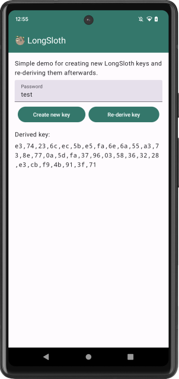
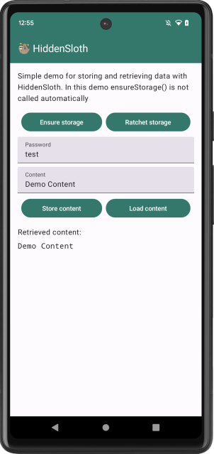

# Sloth: Android

We have implemented both **LongSloth** and (multi-snapshot) **HiddenSloth** for Android.
These are provided as a carefully crafted library that can be included in any Android app.
The main library including all Sloth variants is implemented in the `:sloth` module.
The library can be included with minimumSdk 26 or higher.
However, the main functionalities require API 28+ (Android P).


## Getting started

Using Sloth in your app is straight-forward.
You first add the library as a dependency to your app and then initialize it.
After that, you can create new `LongSloth` or `HiddenSloth` instances under different given identifiers.


### Adding the build dependencies

Add the following dependency to your gradle build file (using Kotlin DSL syntax):

```kotlin
dependencies {
    implementation("com.lambdapioneer.sloth:sloth:0.3.0")
    // ...
}
```

### Initializing the Sloth library

The Sloth library is initialized by creating a `SlothLib` instance and then initializing it using `slothLib.init()`.
Hold onto the `slothLib` instance for the lifetime of your app. Check e.g. the [SampleApplication.kt](app/src/main/java/com/lambdapioneer/sloth/app/SampleApplication.kt) class in the sample app.

The storage that is used by the Sloth library is abstracted behind a `ReadWriteStorage` interface.
For most scenarios you will want to use the `OnDiskStorage` which stores files within the app's private storage.
However, for tests you might want to opt for the `InMemoryStorage` which stores the data in memory.


### Using LongSloth

From the `slothLib` instance we can now create new LongSloth instance.
This instance is specific to an identifier that is provided during creation.
It also takes the `LongSlothParams` which include the `l` value that determines the hardness of the key derivation.
Refer to the paper for more details.
Below is a complete example of how to create and use a LongSloth instance.

```kotlin
// App-level preparation
val slothLib = SlothLib()
slothLib.init() // This will throw if e.g. there is no secure element available.

val storage = OnDiskStorage(context) // you can implement your own storage abstraction

// Context-level preparation
val longSloth = instance.getLongSlothInstance(
    identifier = "your_identifier",
    storage = storage,
    params = LongSlothParams()
)

// Create a new key (will override any keys under that identifier)
val key = longSloth.createNewKey("passphrase")

// Derive a key from the passphrase (assuming `createNewKey`
// was called before for this identifier)
val key = longSloth.deriveForExistingKey("passphrase")
```


### Using HiddenSloth

From the `slothLib` instance we can now create new HiddenSloth instance.
This instance is specific to an identifier that is provided during creation.
It also takes the `HiddenSlothParams` which include `storageTotalSize` which must remain constant throughout the app lifetime.
These parameters also allow specifying the `LongSlothParams` for the underlying LongSloth instance.
Refer to the paper for more details.
Below is a complete example of how to create and use a HiddenSloth instance.

```kotlin
// App-level preparation
val slothLib = SlothLib()
slothLib.init() // This will throw if e.g. there is no secure element available.

val storage = OnDiskStorage(context) // you can implement your own storage abstraction

// Execute the following at _every_ app start.
val hiddenSloth = instance.getHiddenSlothInstance(
    identifier = "your_identifier",
    storage = storage,
    params = HiddenSlothParams(storageTotalSize = 1 * MIB)
)
hiddenSloth.ensureStorage()

// Optionally execute the following on every app start to ensure multi-snapshot security
hiddenSloth.ratchet()

// Store data in the HiddenSloth instance
val data: ByteArray = ...
hiddenSloth.encryptToStorage("passphrase", data)

// Retrieve data from the HiddenSloth instance
val data = hiddenSloth1.decryptFromStorage("passphrase")
```


## Project structure

The project is structured into library modules and a sample app.
The main Sloth library including LongSloth and HiddenSloth is implemented in the `:sloth` module.
We decided to not make it dependent on Argon2 due to APK size implications. 
If you want to use Argon2 (or any other password hashing algorithm) see the `:sloth-pwhash-libsodium` module for information on how to do this.
Resources that are useful for testing are located in the `:testing` module which is then included for the instrumentation tests of both `:sloth` and `:bench`.


### Changing the PwHash algorithm

We decided to make the password hashing algorithm modular and by default the library uses PBKDF2.
However, we provide `sloth-pwhash-libsodium` as an alternative that uses the Argon2id algorithm from the [Libsodium](https://libsodium.org/) library.
By keeping it separate we can avoid the overhead of including the Libsodium library in apps that do not need it.

```kotlin
dependencies {
    implementation("com.lambdapioneer.sloth:sloth-pwhash-libsodium:0.3.0")
    // ...
}
```

Then, you can opt for the Argon2 password hashing algorithm by calling `SlothLib(pwHash = LibSodiumArgon2PwHash())` when initializing the Sloth library.


### Tests and benchmarks

The library is covered using instrumentation tests.
These are located in the `:sloth` module and can be run using `./gradlew :sloth:connectedDebugAndroidTest`.
Additonal ones for the Argon2 password hashing algorithm are located in the `:sloth-pwhash-libsodium` module and can be run using `./gradlew :sloth-pwhash-libsodium:connectedDebugAndroidTest`.

The module `:bench` contains performance benchmarks that are implemented as instrumentation tests.
They can be run using `./gradlew :bench:connectedDebugAndroidTest`.
The benchmarks are also used to generate the performance numbers that are reported in the paper.
For this we provide a script that runs the benchmarks on AWS DeviceFarm and reports back those numbers.

> [!NOTE]
> The tests are also a great resource for learning about more advanced usage of the library.
> Checkout [SlothLibTest](sloth/src/androidTest/java/com/lambdapioneer/sloth/SlothLibTest.kt) for some high-level examples.


### Running on AWS DeviceFarm

> [!NOTE]
> This is not yet documented and will be covered when preparing for artifact evaluation.
> For now, have a look at the script which hopefully is self-explanatory, but it is unsupported otherwise.


### Sample app

The `:app` module features a sample app that uses the Sloth library.
It shows how to integrate the `SlothLib` into a modern app build using ViewModels and Compose.
The app allows to creating new LongSloth keys and re-deriving them.
By default the app builds against the local `:sloth` and `:sloth-pwhash-libsodium` modules.

&nbsp;&nbsp;&nbsp;&nbsp;&nbsp;

You can install it on a device or emulator by running `./gradlew :app:installDebug` from the root directory.
Note that emulators do not have a secure element and thus the app will start, but not work on them.
