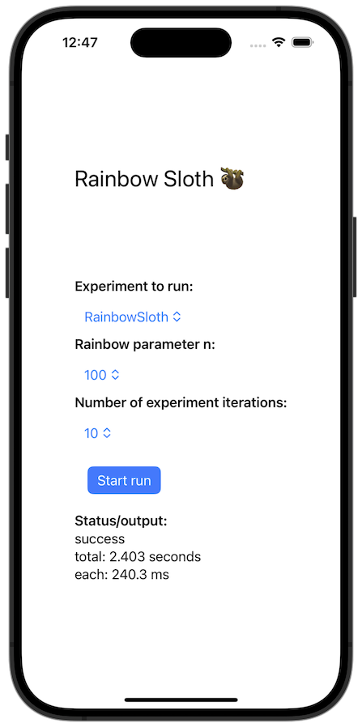

# Sloth: iOS

We have implemented **RainbowSloth** for iOS in this folder
It consists of the `LibSloth` package and the `Sloth` demo app.

## Using the LibSloth package

The `LibSloth` package is synced to another repository to allow it to be included as a Swift package dependency.
Refer to the `README.md` over there: https://github.com/lambdapioneer/sloth-ios

## Tests

Most low-level tests live inside the `LibSloth` package.
However, those that require the Secure Enclave live in the `Sloth` app test target as they require entitlements.
When testing, make sure to execute both sets of tests.

## The benchmark app

The project comes with a benchmark app that is also used to generate the performance numbers that are reported in the paper.
You can install it on a real device or a simulator using Xcode.

For our evaluation we created .IPA files that we then run online using AWS DeviceFarm.
During these runs we manually interacted with the app through the web interface of DeviceFarm.
The app reports the results to a custom server that we run on one of our servers.
The server and how to run it is described inside the [`server` folder](server/).

To replicate these steps first start the server on a server and update the IP address in the [`ContentView.swift`](Sloth/Sloth/ContentView.swift) file.
Start the simulator (or use real devices) and install the IPA file.
Execute the scenarios under test using the UI and observe that results are collected on the server as log files.
